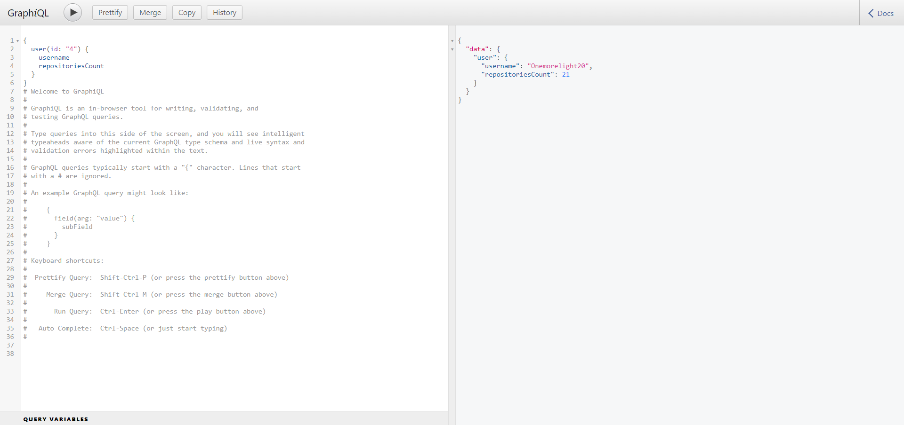
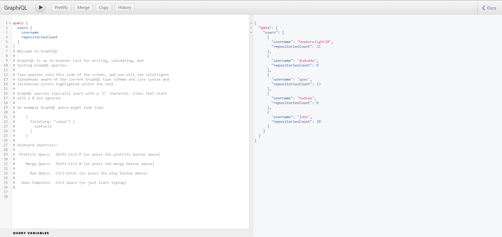
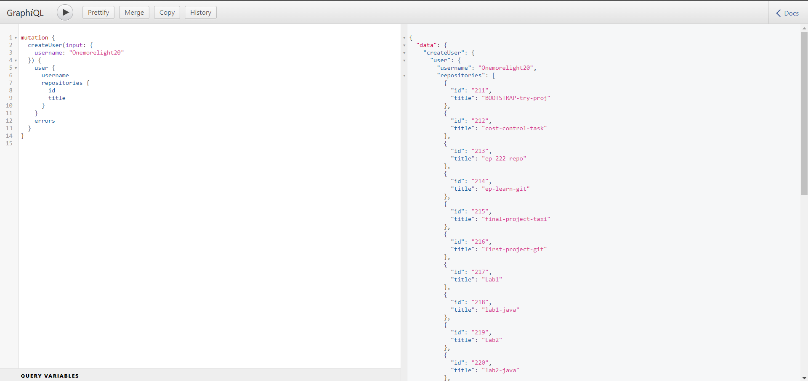

# Coding assessment

Functionality: you can type in Github username and see all the repositories of the user
listed. Also there is an option to see recently added usernames as well as delete them.

* Ruby version 3.1.2p20, RoR version 7.0.3.1

* PostgreSQL was used as a database

* Code was checked and slightly improved using Rubocop 

* To make frontend part look better Bootstrap was used

* Deployed on Heroku: https://quiet-wave-37641.herokuapp.com/

* #### Connected GraphQL to Development run of the project:

